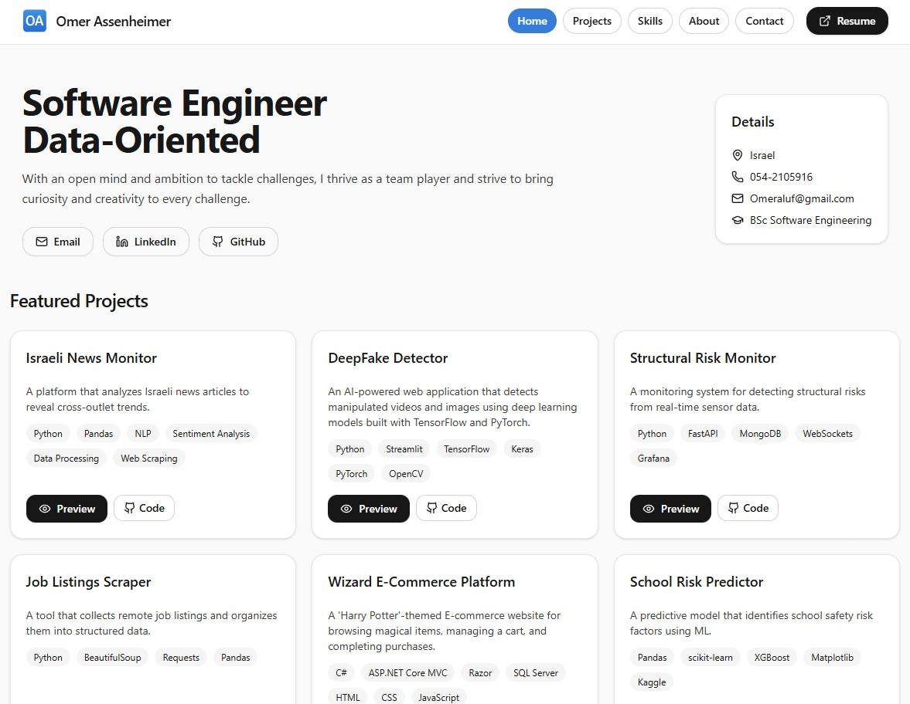

# Omer Assenheimer — Developer Portfolio  

A modern one-page portfolio built with **React**, **TypeScript**, **Tailwind CSS v4**, and **Vite**.  
It showcases my software projects, skills, and contact information in a clean, responsive, and easily maintainable layout.

---

## Live Demo
[omer-assenheimer-portfolio.vercel.app](https://omer-assenheimer-portfolio.vercel.app)  

 

---

## Tech Stack
| Category | Tools |
|-----------|--------|
| Frontend Framework | React 18 + TypeScript |
| Styling | Tailwind CSS v4 |
| Build Tool | Vite |
| UI Toolkit | shadcn/ui  + Lucide Icons |
| Deployment | Vercel (CI/CD from GitHub) |

---

## Key Features
- Reusable UI components (`Button`, `Card`, `PreviewButton`)  
- Video preview cards with hover effects  
- Scroll-spy navigation (reactive active section highlight)  
- Fully responsive layout for desktop and mobile  
- Type-safe data (`INFO`, `PROJECTS`, `SKILLS`)  
- Auto-deployed via Vercel on each commit  

---

## Project Structure
```
src/
  components/
    ui/           # buttons, cards, etc.
  data/           # info, projects, skills
  hooks/          # custom React hooks
  main.tsx        # entry point
  App.tsx         # layout + scroll logic
```

---

## Getting Started
```bash
# 1. Clone the repo
git clone https://github.com/Omeraluf/portfolio.git
cd portfolio

# 2. Install dependencies
npm install

# 3. Run locally
npm run dev
```
App runs at `http://localhost:5173`

---

## Future Plans
- Add Framer Motion animations  
- Dark / Light mode toggle (persistent theme)  
- Add project demo videos and screenshots  
- Analytics (Plausible / Google Analytics 4)  

---

## Author
**Omer Assenheimer** — Software Engineer (Data-Oriented)  
Israel  

[LinkedIn](https://www.linkedin.com/in/omer-assenheimer/)  |  [GitHub](https://github.com/Omeraluf) | [Portfolio](https://omer-assenheimer-portfolio.vercel.app)  


